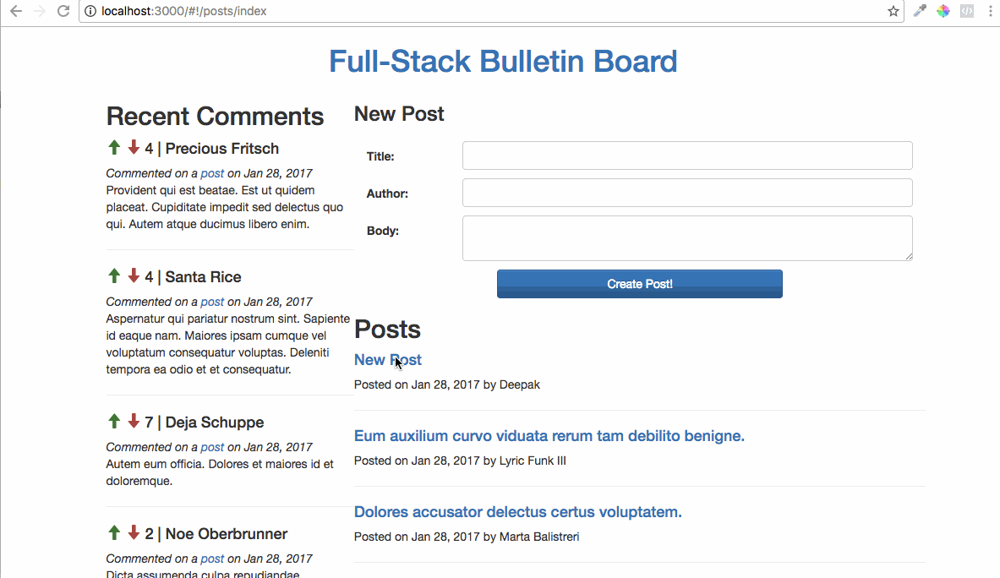

# assignment_full_stack_bulletin_board
Upvoting and upgrading the bulletin board to full-stack status

-Deepak (grcdeepak1)

Steps to Init Angular in Rails:
================================
1. `rails new .`
2. Add gem 'angularjs-rails' and gem 'angular_rails_csrf'
3. Remove gem 'turbolinks', find and remove all occurances
4. Add ui-router, restangular and underscore in vendor/javascript/ and update application.js
5. Add static_pages controller, view and route for index action. Also make it as root route.
6. Add app.js in app/asset/javascript, create and configure an angular app.
7. Add <ui-view></ui-view> in index.html, to display angular app content.

